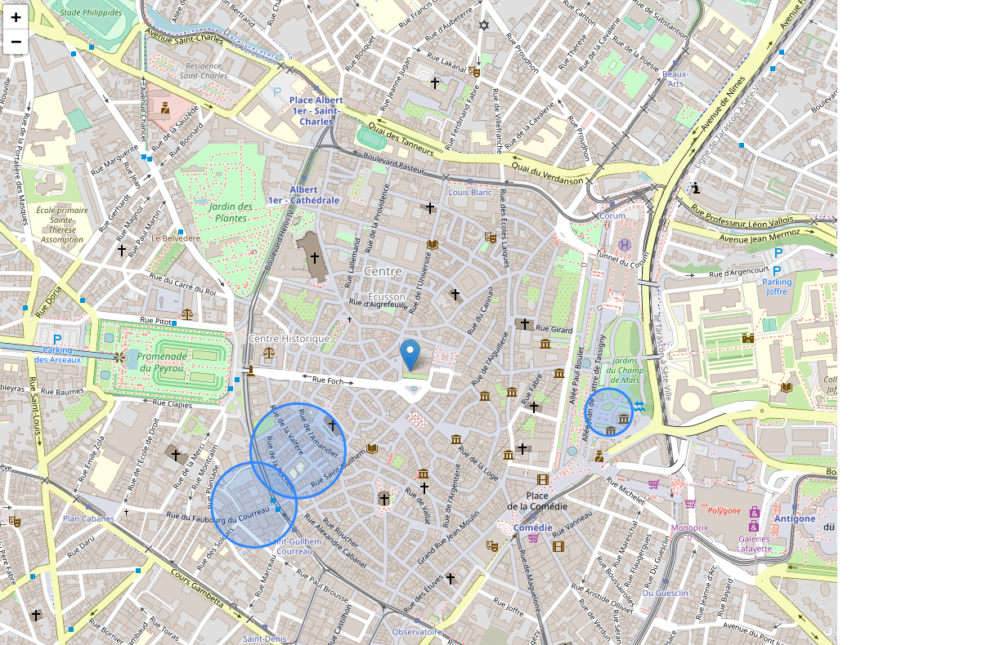

# Geoads

Geofencing demonstration where an app would dispay an ad if a user would be in range.

## Build

To build it simply run

```sh
npm run build
```

Then access the `dist/index.html` in your browser.

## What it does

Move the marker by clicking on the map to simulate the fact that the user is moving.
If you enter a circle it means the user will be in range of an ad therefor it will show it.
If 2 ads overlap then both of the ads will be shown.

